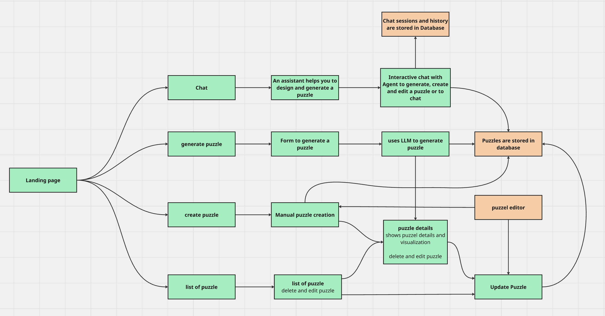

# Puzzle Generator

A web-based application for generating, creating, editing, and visualizing tactical turn-based strategy puzzles. Built with FastAPI, LangGraph, and modern LLM integration, this tool allows you to create interactive puzzle maps with nodes, edges, and unit paths through both manual creation and AI-powered generation.

## Features

### Core Functionality
- **Puzzle Generation**: AI-powered puzzle generation using multiple LLM providers (OpenAI, Google Gemini)
- **Manual Puzzle Creation**: Full control over puzzle design with visual editor
- **Puzzle Visualization**: Interactive SVG-based visualization with zoom, pan, and unit path highlighting (AI generated dummy)
- **Interactive Chat Interface**: Conversational AI assistant (Rudolfo) that helps create puzzles through natural language
- **Puzzle Management**: Create, read, update, and delete puzzles with persistent storage
- **Session Management**: Multi-session chat interface with conversation history

### Technical Features
- **LangGraph Agent**: State-based agent system for intelligent puzzle generation (in process)
- **Database Migrations**: Alembic-based schema versioning
- **HTMX Integration**: Dynamic UI updates without full page reloads
- **Multi-LLM Support**: Switch between different AI models for puzzle generation

## Tech Stack

### Backend
- **FastAPI**: Modern Python web framework
- **SQLAlchemy**: ORM for database operations
- **Alembic**: Database migration tool (does not work yet)
- **LangGraph**: Agent orchestration framework
- **LangChain**: LLM integration framework
- **Pydantic**: Data validation and settings management

### Frontend
- **Jinja2 Templates**: Server-side templating
- **HTMX**: Dynamic HTML updates
- **JavaScript**: Interactive visualizations (Dummy generated by AI)
- **SVG**: Puzzle visualization rendering (Dummy generated by AI)

### LLM Providers
- OpenAI (GPT-4o-mini, GPT-4.1-mini)
- Google Gemini (3 Pro, 2.5 Flash, 2.0 Flash variants)

### Database
- SQLite

## Project Structure

Puzzle-Generator/
├── alembic/                 
│   ├── versions/           
│   └── env.py              
├── app/
│   ├── agents/             # LangGraph agents
│   │   ├── chat_agent.py   # Main chat agent
│   │   └── agent_tools.py  # Agent tools
│   ├── core/               # Core configuration
│   │   ├── config.py       # Settings management
│   │   └── database.py     # Database setup
│   ├── llm/                # LLM client implementations
│   │   ├── openai_client.py
│   │   ├── gemini_client.py
│   │   └── llm_manager.py
│   ├── models/             # SQLAlchemy models
│   │   ├── puzzle_model.py
│   │   ├── node_model.py
│   │   ├── edge_model.py
│   │   ├── unit_model.py
│   │   ├── session_model.py
│   │   └── message_model.py
│   ├── prompts/            # Prompt templates
│   │   ├── prompt_manager.py 
│   │   └── prompt_game_rules.py
│   ├── routers/            # FastAPI routes
│   │   ├── puzzle_routers.py
│   │   └── chat_routers.py
│   ├── schemas/           # Pydantic schemas
│   │   ├── edge_schema.py
│   │   ├── node_schema.py
│   │   ├── path_node_schema.py
│   │   ├── path_schema.py
│   │   ├── puzzle_schema.py
│   │   ├── session_schema.py
│   │   └── unit_schema.py
│   ├── services/           # Business logic
│   │   ├── puzzle_services.py
│   │   └── session_services.py
│   ├── static/             # Static files (JS, CSS)
│   │   ├── visualize_puzzle.js
│   │   ├── editor.js
│   │   └── script.js
│   ├── templates/          # Jinja2 templates
│   │   ├── index.html
│   │   ├── chat.html
│   │   ├── generate-puzzle.html
│   │   └── ...
│   └── main.py             # FastAPI application entry point
├── data/                    # Database files
├── requirements.txt         # Python dependencies
└── alembic.ini             

## Usage

### Generating Puzzles via Chat

1. Navigate to `/puzzles/chat`
2. Start a conversation with Rudolfo (the AI assistant)
3. Describe the puzzle you want to create:
   - "Create a skirmish puzzle with 10 nodes and 3 enemy units"
   - "Generate a skirmish puzzle with 5 player units"
4. The AI will extract requirements and generate the puzzle (in process)
5. The puzzle visualization will automatically appear when created (in process)

### Generating Puzzles via Form

1. Navigate to `/puzzles/generate`
2. Fill in the form:
   - Puzzle name
   - Select LLM model
   - Choose game mode 
   - Set node count, edge count, turns
   - Configure enemy and player units
3. Submit the form
4. The puzzle will be generated and saved

### Manual Puzzle Creation

1. Navigate to `/puzzles/create-puzzle`
2. Use the visual editor to:
   - Add nodes at specific coordinates
   - Connect nodes with edges
   - Define unit paths
   - Set puzzle parameters

### Viewing and Editing Puzzles

- **View all puzzles**: `/puzzles`
- **View puzzle details**: `/puzzles/{puzzle_id}`
- **Edit puzzle**: `/puzzles/{puzzle_id}/update`

## 🗄️ Database Schema

### Main Models

- **Puzzle**: Core puzzle entity with metadata
- **Node**: Graph nodes with x/y coordinates
- **Edge**: Connections between nodes
- **Unit**: Player/enemy units with types and factions
- **Path**: Unit movement paths
- **PathNode**: Ordered path segments
- **Session**: Chat session management
- **Message**: Chat message history
- **Feedback**: Not used yet

## API Endpoints

### Puzzle Endpoints
- `GET /puzzles` - List all puzzles
- `GET /puzzles/{puzzle_id}` - Get puzzle details
- `GET /puzzles/{puzzle_id}/data` - Get puzzle JSON data
- `POST /puzzles/generate` - Generate puzzle via LLM
- `POST /puzzles` - Create puzzle manually
- `PUT /puzzles/{puzzle_id}` - Update puzzle
- `DELETE /puzzles/{puzzle_id}` - Delete puzzle

### Chat Endpoints
- `GET /puzzles/chat` - Chat interface
- `GET /puzzles/chat/{session_id}` - Get session messages
- `POST /puzzles/chat` - Send chat message
- `GET /puzzles/chat/{session_id}/puzzle` - Get session's puzzle (in process)
- `DELETE /puzzles/chat/{session_id}/delete` - Delete session

## Puzzle Visualization

- the current puzzle visualisation is based on a AI generated script.

## LangGraph Agent Flow (in process)

The chat agent uses a state graph with the following nodes:
1. **Intent Classification**: classifies user's intent (generate, create, modify, chat)
2. **Chat**: Handles general conversation
3. **Collect Info**: Extracts puzzle parameters from conversation
4. **Collect and Create**: Generates and stores puzzle

## Configuration

### Database
The default database is SQLite

### LLM Models
Supported models are configured in the LLM manager. Add new models by:
1. Implementing a client in `app/llm/`
2. Adding model selection in templates
3. Updating `llm_manager.py`

## Development

### Code Structure Guidelines
- **Models**: SQLAlchemy ORM models in `app/models/`
- **Schemas**: Pydantic validation schemas in `app/schemas/`
- **Services**: Business logic in `app/services/`
- **Routers**: API endpoints in `app/routers/`
- **Agents**: LangGraph agents in `app/agents/`

## Game Rules

See `app/prompts/prompt_game_rules.py` for complete rules.

